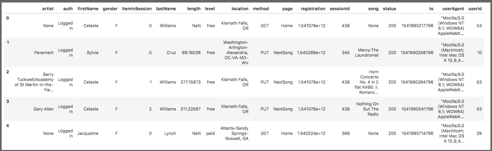

_(Udacity: Data Engineering Nano Degree) | jukka.kansanaho@gmail.com | 2019-07-10_

# PROJECT-5: Data Pipelines

## Quick start

After installing python3 + Apache Airflow libraries and dependencies + copying code under Airflow DAG (Directed Acyclic Graph) folder, run from Airflow UI:

* `etl_dag` DAG (to process all the input JSON data into AWS Redshift.)

---

## Overview

This Project-5 handles data of a music streaming startup, Sparkify. Data set is a set of files in JSON format stored in AWS S3 buckets and contains two parts:

* **s3://udacity-dend/song_data**: static data about artists and songs
  Song-data example:
  `{"num_songs": 1, "artist_id": "ARJIE2Y1187B994AB7", "artist_latitude": null, "artist_longitude": null, "artist_location": "", "artist_name": "Line Renaud", "song_id": "SOUPIRU12A6D4FA1E1", "title": "Der Kleine Dompfaff", "duration": 152.92036, "year": 0}`

* **s3://udacity-dend/log_data**: event data of service usage e.g. who listened what song, when, where, and with which client
  

Below, some figures about the data set (results after running the `etl_dag`):

* s3://udacity-dend/song_data: 14897 files
* s3://udacity-dend/log_data: 31 files

Project builds an ETL pipeline (Extract, Transform, Load) to Extract data from JSON files stored in AWS S3 into AWS Redshift staging tables, process the data into AWS Redshift fact and dimension tables. As technologies, Project-5 uses python, AWS S3, AWS Redshift, and Apache Airflow.

---

## About Database

Sparkify analytics database (called here sparkifydb) schema has a star design. Start design means that it has one Fact Table having business data, and supporting Dimension Tables. Star DB design is maybe the most common schema used in ETL pipelines since it separates Dimension data into their own tables in a clean way and collects business critical data into the Fact table allowing flexible queries.
The Fact Table answers one of the key questions: what songs users are listening to. DB schema is the following:

_*SparkifyDB schema as ER Diagram.*_

### Purpose of the database and ETL pipeline

Purpose of this ETL pipeline is to automate data processing and analysis steps.

### Raw JSON data structures

* **log_data**: log_data contains data about what users have done (columns: event_id, artist, auth, firstName, gender, itemInSession, lastName, length, level, location, method, page, registration, sessionId, song, status, ts, userAgent, userId)
* **song_data**: song_data contains data about songs and artists (columns: num_songs, artist_id, artist_latitude, artist_longitude, artist_location, artist_name, song_id, title, duration, year)

### Fact Table

* **songplays**: song play data together with user, artist, and song info (songplay_id, start_time, user_id, level, song_id, artist_id, session_id, location, user_agent)

### Dimension Tables

* **users**: user info (columns: user_id, first_name, last_name, gender, level)
* **songs**: song info (columns: song_id, title, artist_id, year, duration)
* **artists**: artist info (columns: artist_id, name, location, latitude, longitude)
* **time**: detailed time info about song plays (columns: start_time, hour, day, week, month, year, weekday)

## About ETL pipeline design

Project-5's Airflow DAG consist of the following files:

* **dags/etl_dag.py**: <ADD DESCRIPTION>
* **create_tables.sql**: <ADD DESCRIPTION>
* **plugins/helpers/sql_queries.py**: <ADD DESCRIPTION>
* **plugins/operators/stage_redshift.py**: <ADD DESCRIPTION>
* **plugins/operators/data_quality.py**: <ADD DESCRIPTION>
* **plugins/operators/load_dimensions.py**: <ADD DESCRIPTION>
* **plugins/operators/load_fact.py**: <ADD DESCRIPTION>

---

## HOWTO use

**Project has one DAG:**

* **etl_dag**: This DAG uses data in s3:/udacity-dend/song_data and s3:/udacity-dend/log_data, processes it, and inserts the processed data into AWS Redshift DB.

### Prerequisites

* **Python3** is recommended as the environment. The most convenient way to install python is to use Anaconda (https://www.anaconda.com/distribution/) either via GUI or command line.
* **Apache Airflow** (https://airflow.apache.org/start.html).
* Access to AWS S3 and Redshift services (read and write credentials).

### Run ETL pipeline

* Copy dag files under Airflow dag folder
* In Airflow UI, add AWS S3 and Redshift credentials and other parameters via **Admin => Connections**
* In Airflow UI's **DAGs view**, activate `etl_dag` DAG

Airflow DAG executes the following steps:

* < ADD STEPS >

Output: input JSON data is processed and analysed data is written into Fact and Dimensions tables in AWS Redshift.

## Summary

Project-5 provides customer startup Sparkify tools to automatically analyse their service data in a flexible way and help them answer their key business questions like "Who listened which song and when?"
